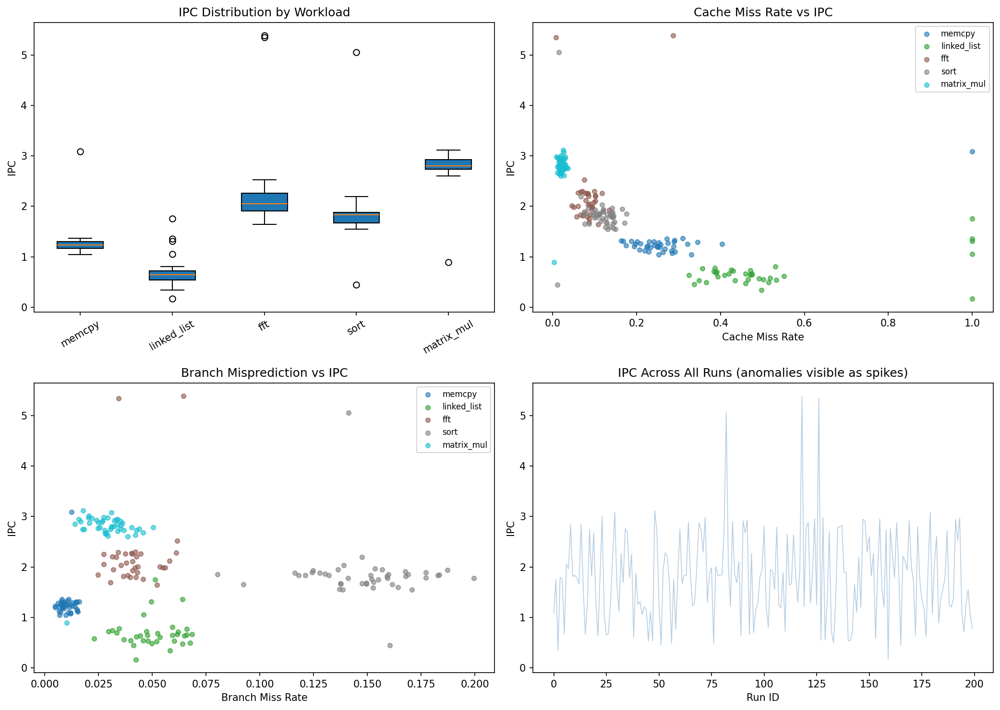
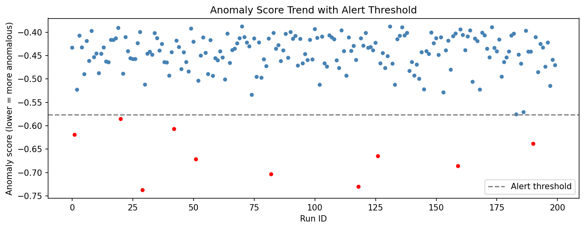

# CPU Performance Counter Analyzer

A Python pipeline for ingesting CPU performance counter data, visualising microarchitectural behaviour, and automatically flagging anomalous runs using ML-based anomaly detection.

## What it does

- Ingests per-run CPU performance counters: IPC, cache miss rate, branch misprediction rate, cycle count, instruction count
- Visualises IPC distribution across workload types (matrix multiply, linked list traversal, FFT, memcpy, sort)
- Identifies correlations between cache/branch behaviour and IPC
- Applies Isolation Forest anomaly detection to flag runs with statistically unusual performance signatures

## Measured results (synthetic dataset: 200 runs, 5 workloads)

| Workload | Runs | Mean IPC | Mean Cache Miss Rate | Characteristic |
| --- | --- | --- | --- | --- |
| matrix_mul | 46 | 2.79 | 2.1% | ALU-bound, cache-friendly |
| fft | 35 | 2.24 | 8.8% | Compute + moderate memory |
| sort | 45 | 1.84 | 11.8% | Branch-heavy |
| memcpy | 39 | 1.27 | 27.1% | Bandwidth-bound |
| linked_list | 35 | 0.69 | 52.0% | Memory-bound, pointer chasing |

## Anomaly detection evaluation

Isolation Forest (contamination=5%) flagged 10 of 11 injected anomalies with 0 false positives (precision 1.00, recall 0.91), using no labels for training. The one missed run is a matrix_mul run whose IPC looks normal next to other workloads, because one model is fit across all workloads.

Notes: the data is synthetic, `contamination` was set equal to the injection rate, and the alert threshold is the 5th percentile of the anomaly scores (the same cut as `contamination`).

## Usage

```bash
pip install -r requirements.txt
python src/generate_data.py
python src/analyze.py
python src/anomaly.py
```

## Results



